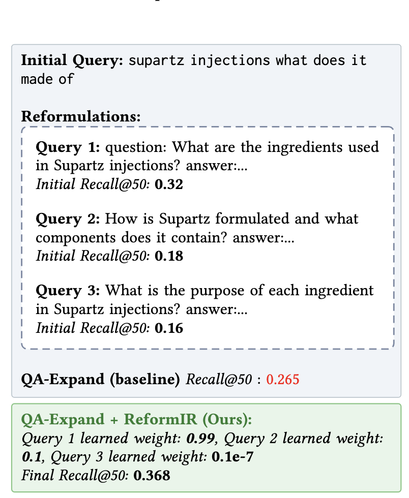

# ReformIR

This repo contains the code , generated reformulations and run files to reproduce the main results.

ReformIR helps reduce drift in reformulations by prioritzing reformulations and documents. ReformIR is also interpretable and
and example is given below:

<!--  -->

# Steps
1. First create a conda environment : conda create -n ReformIR python=3.11
2. conda activate ReformIR
3. Install dependencies: pip install -r requirements.txt


# To reproduce results 
1. To reproduce the numbers in Tables 1 and 2 just specify the appropriate name in the run_dl19 or run_dl20 etc. script based on the test set you want to focus on.


# To run the approaches from scratch without using runfiles 
1. Build indices: python3 code/build_indexes.py
2. The generated reformulations are given in data folder. Just provide the right path based on results you want to reproduce and change mode to overwrite from reuse.
3. The for instance if you want to reproduce genqr ensemble and genqr ensemble plus reform IR results from table 2 run:
```python3 code/run_dl22.py --dl 22 --ce 4 --budget 50 --reformulation_file=data/genqr_ensemble/dl22.csv```

